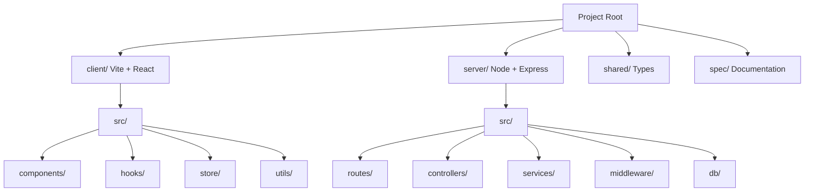

# Architecture Specification: Swing Your Swing

## Project Layout

## Folder Descriptions

### `client/`
The frontend application.
- `src/components/`: Reusable UI components (buttons, cards, dashboard widgets).
- `src/hooks/`: Custom React hooks for data fetching and state management.
- `src/store/`: Context or global state management for user profile and session data.
- `src/utils/`: Formatting, math (for angle normalization), and API client logic.

### `server/`
The Backend-for-Frontend (BFF) layer.
- `src/routes/`: API endpoint definitions (REST/Express).
- `src/controllers/`: Business logic handlers for each route.
- `src/services/`: External integrations (Gemini API, FFmpeg for video processing, File Storage).
- `src/middleware/`: Auth, request validation (Zod), and error handling.
- `src/db/`: SQLite initialization and query layer (better-sqlite3).
- `uploads/`: Temporary storage for uploaded MP4s and launch monitor images.

### `shared/`
Common TypeScript definitions.
- `types/`: Shared interfaces for `Swing`, `Player`, `Metric`, and `Lesson` to ensure type safety across the stack.

### `spec/`
Design and implementation documentation.
- `impl.spec.md`: This architecture map.
- `api.spec.md`: (Future) API contract definitions.

## Key Technical Workflows

1.  **Video Ingestion**: 
    - Client uploads MP4 -> Server saves to `uploads/`.
    - Server triggers Gemini Multimodal analysis.
    - Gemini returns JSON metrics (angles, swing points).
    - Data stored in SQLite.
2.  **Swing Comparison**: 
    - Server retrieves "Pro" (Toro) data from a static dataset or Gemini knowledge.
    - Frontend calculates deltas and visualizes them.
3.  **Progress Tracking**:
    - Query SQLite for historical `swing_metrics`.
    - Frontend renders charts (Line/Bar) for improvement over time.
